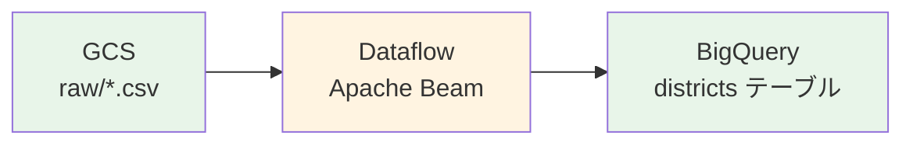

# 02-Dataflowパイプライン（データ変換）

## 概要
Apache Beam を使って、GCS(Google Cloud Storage) に保存された選挙データを変換し、BigQueryにロードする。



--- 
## データ変換処理

### 1. データクレンジング（`CleanElectionData`）
- 前後の空白除去
- 数値フィールドの型変換（`votes`, `age`, `vshare`, `election_year`）
- カンマ区切り数値の処理（"50,000"->50000）

### 2. 政党名の正規化（`NormalizePartyName`）
表記揺れを統一する。

```python
"自民" -> "自由民主党"
"立民" -> "立憲民主党"
"維新" -> "日本維新の会"
```

### 3. 選挙区コードの追加（`AddDistrictCode`）
JIS X 0401（都道府県コード）を使用する。

```
東京1区 -> prefecture_code: "13", district_code: "13-01"
大阪3区 -> prefecture_code: "27", district_code: "27-03"
```

都道府県名の正規化:

- "岩手" -> "岩手県"
- "東京" -> "東京都"
- "大阪" -> "大阪府"

### 4. BigQuery スキーマへの適合（`FormatForBigQuery`）
- Boolean フィールドの変換（1/0 -> True/False）
- NULL値の統一（"NA","nan","" -> None）

--- 

## 実行方法

前提条件

```bash
# 環境変数を設定
export GCS_BUCKET_NAME=[your-bucket-name] # 自分で決めた値
export GCS_PROJECT_ID=[your-gcp-project-id] # 同上
```

サービスアカウントのセットアップ（初回のみ）

```bash
# サービスアカウントと権限を作成
./setup_service_account.sh
```

作成される権限:
- サービスアカウント：`dataflow-pipeline-runner@[設定したPROJECTID].iam.gserviceaccount.com`
  - `roles/dataflow.worker`
  - `roles/storage.objectAdmin`
  - `roles/bigquery.dataEditor`
  - `roles/bigquery.jobUser`
- ユーザーアカウント
  - `roles/dataflow.admin`
  - `roles/iam.serviceAccountUser`

--- 

## ローカル実行（DirectRunner）
開発・テスト用で、料金が発生しない。
```bash
# 実行 
./run_local.sh 
```

特徴:
- ✅ 無料
- ✅ 日本語対応
- ⏳ 実行時間：3〜5分
- 📈 小〜中規模データ向け

内部処理：
- `FILE_LOADS` メソッドでも日本語が正しく処理されるよう、<br>
  JSONエンコーディングをモンキーパッチで修正
- `write_method=STREAMING_INSERTS` を使用（DirectRunner では FILE_LOADS で日本語問題が発生するため）

--- 
## Dataflow 実行(DataflowRunner)
本番環境。GCP上で分散実行。

推奨：us-central1リージョン
```bash
# BigQuery データセット作成（US リージョン）
bq mk --dataset \
  --location=US \
  --description="選挙データパイプライン" \
  ${GCS_PROJECT_ID}:election_data

# 実行 
./run_dataflow_us.sh
```

特徴：
- ✅ 高速（5〜10分）
- ✅ リソース豊富（ストックアウトなし）
- ✅ 確実に動作
- 💰 少額課金（数十円〜数百円程度）

--- 
## トラブルシューティング
### 問題1：権限エラー（403 Forbidden）
エラー例：
```bash 
HttpForbiddenError: Cloud not create workflow; user does not have write access
premission: "dataflow.jobs.create"
```

原因：環境変数 `GOOGLE_APPLICATION_CREDENTIALS` に古い認証情報が残っている。

解決策：
```bash 
# 環境変数をクリア
unset GOOGLE_APPLICATION_CREDENTIALS

# 認証をリフレッシュ
gcloud auth application-default login 

# 再実行
./run_dataflow.sh
```

詳細説明：<br>
Python から GCP API を呼び出す際の認証情報の優先順位
1. 環境変数 `GOOGLE_APPLICATION_CREDENTIALS`
2. `gcloud auth application-default login`
3. Compute Engine メタデータサーバー

古い環境変数が残っていると、新しい認証が無視されるため、<br>
`unset` してから再認証が必要。

### 問題2：リソース不足（ZONE_RESOURCE_POOL_EXHAUSTED）
エラー例：
```bash
The zone `asia-northeast1-a` does not have enough resources available
ZONE_RESOURCE_POOL_EXHAUSTED
```

原因：東京リージョン（asia-northeast1）で Compute Engine のリソースが一時的に枯渇していると思われる。

解決策：
```bash 
# us-central1 実行 
./run_dataflow_us.sh
```

なぜ us-central1？

- asia-northeast1：リソース不足が解消しなかった。（複数ゾーン全てでストックアウト発生）
- us-central1：リソースが豊富らしく、安定して動作した。


### 問題3：日本語が Unicode エスケープされる
症状：BigQuery で `\u5317\u6d77\u9053` のように表示される

原因：Apache Beam のJSONエンコーダーがデフォルトで `ensure_ascii=True` を使用 

解決策：モンキーパッチ適用
```python
_original_json_dumps = json.dumps 
def _patched_json_dumps(obj, **kwargs):
    kwargs["ensure_ascii"] = False 
    return _original_json_dumps(obj, **kwargs)
json.dumps = _patched_json_dumps
```

### 問題4：prefecture_code が NULL 
症状：都道府県コードが入らない

原因：CSVデータの都道府県名に「県」が付いてない。

解決策：都道府県名を正規化する処理を実装することで対応

```python
# AddDistrictCode DoFn で実装
if pref_name == "北海道":
    normalized_pref = "北海道"
elif pref_name == "東京":
    normalized_pref = "東京都"
elif pref_name in ["大阪", "京都"]:
    normalized_pref = f"{pref_name}府"
else:
    normalized_pref = f"{pref_name}県"
```

### 問題5：スキーマ不一致
症状：BigQuery ロード時にJSONパースエラー

原因：
- CSVのカラム名が `vshare` だが、当初のスキーマでは `votshare`
- `recommended`, `lastname`, `firstname` などのフィールドがスキーマに含まれていない。
- `prefecture_code` がINTEGERとして自動検出されるが、実際はSTRING（"01"など）

解決策：スキーマを実際のデータに合わせて修正済み（辞書形式で明示的に型指定）

### 問題6：DoFn でのデータ変更
症状：テストで予期しない値が入る、データが壊れる

原因：Apache Beam の DoFn で `element` を直接変更すると、不変性が壊れる。

NG：
```python
def process(self, element):
    element["new_field"] = "value"
    yield element
```

OK：
```python
def process(self, element):
    result = copy.deepcopy(element)
    result["new_field"] = "value"
    yield result
```

---

## BigQuery スキーマ

テーブル：districts（小選挙区データ）

カラム名|型|説明 
:-|:-|:-
prefecture|STRING|都道府県名（例：北海道）
prefecture_code|STRING|都道府県コード（例：01）
district|STRING|選挙区名（例：北海道1区）
district_code|STRING|選挙区コード（例：01-01）
dist_no|INTEGER|選挙区番号
name|STRING|候補者氏名
yomi|STRING|候補者読み
lastname|STRING|姓
firstname|STRING|名 
last_kana|STRING|姓（かな）
first_kana|STRING|名（かな）
age|INTEGER|年齢
party|STRING|所属政党（原文）
party_normalized|STRING|政党名（正規化済み）
party_original|STRING|政党名（元の表記）
recommended|STRING|推薦政党
status|STRING|元/前/新 
previous|INTEGER|当選回数 
duplicate|BOOLEAN|重複立候補
win_smd|BOOLEAN|小選挙区当選
win_pr|BOOLEAN|比例復活当選
votes|INTEGER|投票数
vshare|FLOAT|得票率（%）
data_type|STRING|データ種別
election_year|INTEGER|選挙年

### Dataflow完了後の確認コマンド一覧

レコード数確認
```bash
bq query --use_legacy_sql=false \
  "SELECT COUNT(*) as total FROM \`${GCS_PROJECT_ID}.election_data.districts\`"
```
期待される結果：1,000〜2,000レコード程度

都道府県コードの確認
```bash
bq query --use_legacy_sql=false \
  "SELECT
    prefecture,
    prefecture_code,
    district_code,
    COUNT(*) as count 
  FROM \`${GCS_PROJECT_ID}.election_data.districts\`
  WHERE prefecture_code IS NOT NULL 
  GROUP BY prefecture, prefecture_code, district_code
  ORDER BY prefecture, prefecture_code
  LIMIT 10
  "
```
期待される結果：全てのレコードで `prefecture_code` と `district_code` が入っている。

政党別当選者数
```bash
bq query --use_legacy_sql=false \
  "SELECT
    election_year,
    party_normalized,
    COUNT(*) as winners,
    SUM(votes) as total_votes
   FROM \`${GCS_PROJECT_ID}.election_data.districts\`
   WHERE win_smd = TRUE 
   GROUP BY election_year, party_normalized
   ORDER BY election_year DESC, winners DESC
  "
```
期待される結果：自由民主党が最多当選、立憲民主党が2位など

--- 

## ファイル構成

```tree 
02_dataflow_pipeline/
├── election_pipeline.py          # メインパイプライン
├── test_election_pipeline.py     # ユニットテスト
├── setup_service_account.sh      # サービスアカウント作成スクリプト
├── run_local.sh                  # DirectRunner 実行スクリプト
├── run_dataflow.sh               # DataflowRunner 実行（asia-northeast1）
├── run_dataflow_us.sh            # DataflowRunner 実行（us-central1）
└── README.md                     # このファイル
```

--- 

## GCP 試験対策ポイント

### データパイプライン設計
- ✅ ETL vs ELT の選択基準
- ✅ バッチ vs ストリーミング処理
- ✅ DirectRunner vs DataflowRunner の使い分け

### Apache Beam の概念
- ✅ PCollection（不変データセット）
- ✅ PTransform（データ変換）
- ✅ DoFn（カスタム処理ロジック）
- ✅ ParDo（並列分散処理）
- ✅ データの不変性（immutability）

### 権限管理
- ✅ サービスアカウントの作成と権限付与
- ✅ 最小権限の原則
- ✅ IAMロールの適切な選択
- ✅ `GOOGLE_APPLICATION_CREDENTIALS` の優先順位 

### リージョン選択
- ✅ レイテンシ vs リソース可用性
- ✅ データローカリティ規制
- ✅ コスト最適化
- ✅ ストックアウト対策

### トラブルシューティング
- ✅ 権限エラーのデバッグ方法
- ✅ リソース不足の対処法
- ✅ 文字エンコーディング問題
- ✅ スキーマ不一致の解決

--- 

## 次のステップ

----> 03_bigquery - BigQuery での分析・集計

BigQueryで行う処理：
- 政党別得票数の集計
- 都道府県別分析ビューの作成
- 時系列比較クエリ（2021年 vs 2024年）
- Looker Studio でのダッシュボード作成

--- 

## 参考リンク

- [Apache Beam 公式ドキュメント](https://beam.apache.org/documentation/)
- [Dataflow トラブルシューティング](https://cloud.google.com/dataflow/docs/guides/common-errors)
- [BigQuery スキーマ設計](https://cloud.google.com/bigquery/docs/schemas)
- [GCPIAM ベストプラクティス](https://cloud.google.com/iam/docs/best-practices)

