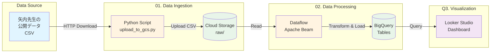

# GCP Election Data Pipeline - ポートフォリオ

[](https://github.com/udai0621/GoogleCloud/actions/workflows/test-election-pipeline.yml)


GCP Professional Data Engineer 試験の学習を目的とした、衆議院議員総選挙データの収集・加工・分析パイプラインです。

## プロジェクト概要


```

## データソース

**矢内勇生先生（高知工科大学）の公開データ**  
https://yukiyanai.github.io/resources/

- ライセンス: CC BY 4.0
- 第50回（2024年）、第49回（2021年）衆議院議員総選挙
- 小選挙区・比例区データ

## 技術スタック

| カテゴリ | 技術 |
|---------|------|
| **言語** | Python 3.9+ |
| **GCP サービス** | Cloud Storage, Dataflow, BigQuery, Looker Studio |
| **データ処理** | Apache Beam, Pandas |
| **CI/CD** | GitHub Actions |
| **IaC** | Terraform (予定) |

## ディレクトリ構成

```tree
GoogleCloud/
├── election-data-pipeline/
│   ├── 01_upload_to_gcs
│   │   ├── README.md
│   │   ├── requirements.txt
│   │   ├── test_upload_to_gcs.py
│   │   └── upload_to_gcs.py
│   ├── 02_dataflow_pipeline
│   ├── 03_bigquery
│   ├── 04_visualization
│   └── README.md
└── README.md
```

## セットアップ

### 1. GCP プロジェクトの準備

```bash
# プロジェクトIDを設定
export GCP_PROJECT_ID="<your-gcp-project-id>"

# GCS バケット作成
gcloud storage buckets create gs://<your-election-data-bucket> \
  --location=asia-northeast1 \
  --project=$GCP_PROJECT_ID

# サービスアカウント作成
gcloud iam service-accounts create election-pipeline-sa \
  --display-name="Election Pipeline Service Account"

# 権限付与
gcloud projects add-iam-policy-binding $GCP_PROJECT_ID \
  --member="serviceAccount:election-pipeline-sa@$GCP_PROJECT_ID.iam.gserviceaccount.com" \
  --role="roles/storage.objectAdmin"

# キーファイル取得
gcloud iam service-accounts keys create ~/election-sa-key.json \
  --iam-account=election-pipeline-sa@$GCP_PROJECT_ID.iam.gserviceaccount.com
```

### 2. 環境変数のセット

```bash
export GCS_BUCKET_NAME="<your-election-data-bucket>"
export GCS_PROJECT_ID="<your-gcp-project-id>"
export GOOGLE_APPLICATION_CREDENTIALS="$HOME/<election-sa-key.json>"
```

### 3. 実行

```bash
cd 01_upload_to_gcs
pip install -r requirements.txt
python upload_to_gcs.py
```

## テスト実行

```bash
cd 01_upload_to_gcs
pip install pytest pytest-cov
pytest test_upload_to_gcs.py -v
```

## GCP Professional Data Engineer 試験との対応

| ステップ | 試験ドメイン | 主な技術要素 |
|---------|-------------|-------------|
| 01_upload_to_gcs | データ取り込み設計 | GCS, Python, バッチ処理 |
| 02_dataflow_pipeline | データ処理システムの構築 | Dataflow, Apache Beam, ETL |
| 03_bigquery | データ分析の運用 | BigQuery, スキーマ設計, SQL |
| 04_visualization | データの可視化 | Looker Studio, ダッシュボード設計 |

## ライセンス

このプロジェクトは学習目的のポートフォリオです。

**データ出典**:  
矢内勇生「第50回衆議院議員総選挙データ」  
https://yukiyanai.github.io/jp/resources/data/hr2024election.html
